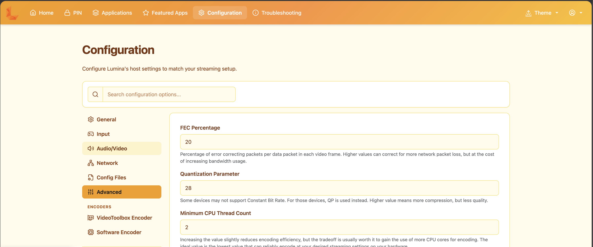

<div align="center">
  
  <h1>Lumen Fusion</h1>
  <p>Native macOS game streaming for Moonlight clients.</p>
  
</div>

Lumen Fusion is a macOS-focused descendant of [Lumen](https://github.com/trollzem/Lumen) and [Sunshine](https://github.com/LizardByte/Sunshine). It runs as a menu-bar application, captures the Mac display and system audio through native macOS APIs, and streams to [Moonlight](https://moonlight-stream.org/) clients.

## Install the native macOS app

The native DMG is the primary installation path. Open the [Lumen Fusion releases page](https://github.com/ovlerfork/Lumen-Fusion/releases) and choose the DMG for the release you intend to install. It does not require Terminal, Homebrew, `sudo`, or a source build.

1. If upgrading, choose **Quit** from the old app's menu bar and wait for it to exit.
2. Open the DMG and drag **Lumen Fusion.app** into **Applications**. In Finder, replace the previous copy when asked.
3. Eject the disk image.
4. Open **Lumen Fusion** from **Applications**.

Lumen Fusion is a menu-bar app, so it may not show a Dock icon or main window. Use its menu-bar icon to open the local administration page in your browser, set the administrator account, and pair a Moonlight client.

Your settings, certificates, and existing Moonlight pairings stay in `~/.config/lumina/`. Replacing the application does not erase that directory. An older command-line installation may still exist; use the copy in **Applications** when checking an upgrade.

### First launch and permissions

If macOS blocks this app because it cannot verify the developer, first verify the download source. Then use this app's **Open Anyway** action in **System Settings → Privacy & Security** and open it again. Do not use broad quarantine-removal commands.

Grant **Screen & System Audio Recording** when macOS asks. It is required for display capture and native system-audio capture. Grant **Accessibility** when you need remote keyboard or mouse control. If macOS asks you to quit and reopen the app after changing a permission, do so; an application update can require permission again.

System audio uses ScreenCaptureKit and is captured as stereo. Leave the audio device unset, or use `audio_sink = system` in `~/.config/lumina/sunshine.conf`. Virtual audio devices such as BlackHole are optional and are not required for native system audio.

### Launch at login

The menu-bar Launch at Login setting is opt-in and off by default. It uses `SMAppService.mainAppService`, macOS's per-user application login item, rather than a system daemon. The menu reflects the system approval status. If macOS reports that approval is required, open the system Login Items settings and approve it there; cancelling leaves it disabled. You can also turn the setting off, and the app does not enable it again by itself.

## Pair and stream

1. Open the local administration page from the menu bar.
2. Complete the administrator setup if prompted.
3. In Moonlight, discover Lumen Fusion on the local network or add the Mac manually.
4. Enter Moonlight's pairing PIN in the local administration page.
5. Start a stream.

The local administration page listens on `https://localhost:47990`. Moonlight discovery uses the local network; remote access requires appropriate network configuration.

## Configuration

Configuration lives in `~/.config/lumina/`:

| Path | Purpose |
| --- | --- |
| `sunshine.conf` | Streaming, audio, encoder, and network settings |
| `sunshine_state.json` | Local administration state and paired clients |
| `credentials/` | TLS certificates and pairing material |
| `apps.json` | Applications shown to Moonlight |
| `sunshine.log` | Runtime log |

Useful settings include:

```ini
# Native ScreenCaptureKit system audio. Leaving the device unset also uses it.
audio_sink = system

# Optional virtual display behavior.
virtual_display = disabled

# Maximum streaming bitrate, in kbps.
max_bitrate = 80000
```

Use the local administration page for routine configuration. The application preserves existing configuration and pairing data while you replace the `.app` bundle.

## Troubleshooting

| Problem | What to check |
| --- | --- |
| No image or system audio | Grant Screen & System Audio Recording, then quit and relaunch if macOS requests it. |
| Remote keyboard or mouse does not work | Grant Accessibility, then relaunch if requested. |
| macOS says the developer cannot be verified | Verify the download source, then use this app's Open Anyway action in Privacy & Security. |
| The old build still starts | Launch `/Applications/Lumen Fusion.app`; an old command-line installation may still be on your PATH. |
| Moonlight cannot pair | Open the local administration page from the menu bar and enter the PIN shown by Moonlight. |

For a defect report, include the macOS version, app build or commit, client type, and the relevant part of `~/.config/lumina/sunshine.log` with any credentials removed.

## Historical technical notes

The repository keeps its source and upstream lineage for developers and contributors. These notes describe implementation history; they are not installation requirements or current performance guarantees:

- [Lumen Fusion incremental changes and provenance (Chinese)](docs/LUMEN_FUSION_OPTIMIZATIONS.zh-CN.md)
- [Streaming-performance diagnostic format](docs/streaming-performance-logging.md)
- [Lumen](https://github.com/trollzem/Lumen) and [Sunshine](https://github.com/LizardByte/Sunshine) upstream projects

## License

Lumen Fusion is licensed under the same terms as Sunshine (GPLv3). See [LICENSE](LICENSE).
