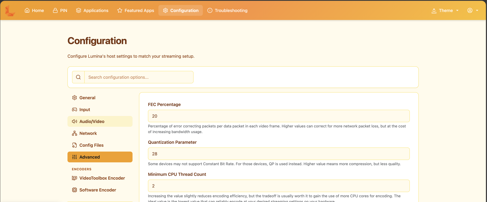

<div align="center">
  
  <h1>Lumen Fusion</h1>
  <p>Native macOS game streaming for Moonlight clients.</p>
  
</div>

Lumen Fusion is a macOS-focused descendant of [Lumen](https://github.com/trollzem/Lumen) and [Sunshine](https://github.com/LizardByte/Sunshine). It runs as a menu-bar application, captures the Mac display and system audio through native macOS APIs, and streams to [Moonlight](https://moonlight-stream.org/) clients.

## Install the native macOS app

Requires **Apple Silicon and macOS 15 or later**. The native DMG is the primary installation path. Open the [Lumen Fusion releases page](https://github.com/ovlerfork/Lumen-Fusion/releases) and choose the DMG for the release you intend to install. It does not require Terminal, Homebrew, `sudo`, or a source build.

1. If upgrading, choose **Quit** from the old app's menu bar and wait for it to exit.
2. Open the DMG and drag **Lumen Fusion.app** into **Applications**. In Finder, replace the previous copy when asked.
3. Eject the disk image.
4. Open **Lumen Fusion** from **Applications**.

Lumen Fusion is a menu-bar app, so it may not show a Dock icon or main window. Use its menu-bar icon to open the local administration page in your browser, set the administrator account, and pair a Moonlight client.

Your settings, certificates, and existing Moonlight pairings stay in `~/.config/lumina/`. Replacing the application does not erase that directory. An older command-line installation may still exist; use the copy in **Applications** when checking an upgrade.

### First launch and permissions

Preview builds are **ad-hoc signed, not Developer ID signed or Apple-notarized**. An update can require a new app-specific approval; no system-wide security changes are needed.

If macOS blocks this app because it cannot verify the developer, first verify the download source. Then use this app's **Open Anyway** action in **System Settings → Privacy & Security** and open it again. Do not use broad quarantine-removal commands.

Grant **Screen & System Audio Recording** when macOS asks. It is required for display capture and native system-audio capture. Grant **Accessibility** when you need remote keyboard or mouse control. If macOS asks you to quit and reopen the app after changing a permission, do so; an application update can require permission again.

System audio uses ScreenCaptureKit and is captured as stereo. Leave the audio device unset, or use `audio_sink = system` in `~/.config/lumina/sunshine.conf`. Virtual audio devices such as BlackHole are optional and are not required for native system audio.

### Launch at login

The menu-bar Launch at Login setting is opt-in and off by default. It uses `SMAppService.mainAppService`, macOS's per-user application login item, rather than a system daemon. The menu reflects the system approval status. If macOS reports that approval is required, open the system Login Items settings and approve it there; cancelling leaves it disabled. You can also turn the setting off, and the app does not enable it again by itself.

## Adaptive virtual desktop (opt-in)

In **Configuration → Audio/Video**, enable the virtual display and select **Adaptive** layout. Existing installations keep their previous Extend/Mirror/System behavior until you select this mode.

| Situation | Adaptive behavior |
| --- | --- |
| Another local screen is usable | The remote display is an extension. Its default disconnect action removes it, allowing macOS to return windows to the remaining screen. |
| No other local screen is usable | The virtual display becomes primary. Temporary disconnect stops media but retains the desktop for Resume. |
| A local screen returns while paused | After a short availability check, the local screen becomes primary again and the unused virtual screen is removed under the default policy. |
| A local screen returns while streaming | The virtual screen becomes an extension without ending its active stream. |
| Explicitly end the remote desktop session or quit Lumen Fusion | Retained desktop resources and the app's idle-power assertions are released. |

The local-screen and headless disconnect actions are independently configurable. Retention defaults to **600 seconds (10 minutes)**; **0** keeps the desktop until you explicitly end the session or release it. The menu-bar **Virtual Desktop…** entry shows its state and allows releasing an unused desktop. No capture, video/audio encoding, or media packet loop is kept running solely for retention; applications and WindowServer may still render their own content.

The power setting can prevent system idle sleep, prevent both display and system idle sleep, or leave idle sleep unrestricted. **Battery keep-awake is off by default**: a retained desktop can remain, but disallowed idle-power assertions are released. Permit battery keep-awake explicitly when needed, including if turning off a USB-C monitor also removes charging power. Unknown power state does not grant indefinite keep-awake.

Display detection excludes this app's virtual screen and checks active/awake local outputs and closed-lid state. Some monitors or docks continue advertising a powered-off panel; **Local display detection → Treat as absent/present** provides an override. Detection is not a guarantee that the panel is physically visible. Windows and full-screen Spaces are managed by macOS; not every application's window placement can be guaranteed.

Resume reuses a still-owned, usable virtual display. If the client negotiates a different resolution or frame rate while the desktop is retained, the desktop keeps its current mode and the media pipeline scales to the requested output. End the desktop session and reconnect to change the desktop's mode.

This feature does **not** unlock the Mac, change password policies, or override manual sleep, lid-close sleep, thermal protection, or low-battery sleep. It is not a replacement for macOS closed-display operating requirements. Idle-sleep prevention and screen-lock policy remain separate.

## Pair and stream

1. Open the local administration page from the menu bar.
2. Complete the administrator setup if prompted.
3. In Moonlight, discover Lumen Fusion on the local network or add the Mac manually.
4. Enter Moonlight's pairing PIN in the local administration page.
5. Start a stream.

The local administration page listens on `https://localhost:47990`. Moonlight discovery uses the local network; remote access requires appropriate network configuration.

## Configuration

Configuration lives in `~/.config/lumina/`:

| Path | Purpose |
| --- | --- |
| `sunshine.conf` | Streaming, audio, encoder, and network settings |
| `sunshine_state.json` | Local administration state and paired clients |
| `credentials/` | TLS certificates and pairing material |
| `apps.json` | Applications shown to Moonlight |
| `sunshine.log` | Runtime log |

Useful settings include:

```ini
# Native ScreenCaptureKit system audio. Leaving the device unset also uses it.
audio_sink = system

# Optional virtual display behavior.
virtual_display = disabled

# Maximum streaming bitrate, in kbps.
max_bitrate = 80000
```

Use the local administration page for routine configuration. The application preserves existing configuration and pairing data while you replace the `.app` bundle.

## Troubleshooting

| Problem | What to check |
| --- | --- |
| No image or system audio | Grant Screen & System Audio Recording, then quit and relaunch if macOS requests it. |
| Remote keyboard or mouse does not work | Grant Accessibility, then relaunch if requested. |
| macOS says the developer cannot be verified | Verify the download source, then use this app's Open Anyway action in Privacy & Security. |
| The old build still starts | Launch `/Applications/Lumen Fusion.app`; an old command-line installation may still be on your PATH. |
| Moonlight cannot pair | Open the local administration page from the menu bar and enter the PIN shown by Moonlight. |

For a defect report, include the macOS version, app build or commit, client type, and the relevant part of `~/.config/lumina/sunshine.log` with any credentials removed.

## Historical technical notes

The repository keeps its source and upstream lineage for developers and contributors. These notes describe implementation history; they are not installation requirements or current performance guarantees:

- [Lumen Fusion incremental changes and provenance (Chinese)](docs/LUMEN_FUSION_OPTIMIZATIONS.zh-CN.md)
- [Streaming-performance diagnostic format](docs/streaming-performance-logging.md)
- [Lumen](https://github.com/trollzem/Lumen) and [Sunshine](https://github.com/LizardByte/Sunshine) upstream projects

## License

Lumen Fusion is licensed under the same terms as Sunshine (GPLv3). See [LICENSE](LICENSE).
